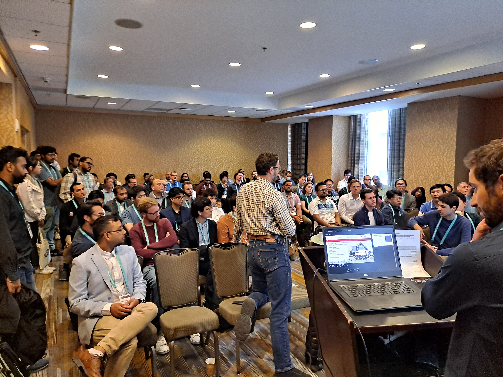

# Physics-Informed Machine Learning (PIML) tutorial ACC 2023
Material for the tutorial session "Physics-Informed Machine Learning for Modeling and Control of Dynamical
Systems: Opportunities and Challenges" presented at the American Control Conference (ACC) 2023.

## Tutorial paper
<a href="./PIML_for_Control_paper_ACC23_Session.pdf" target="_blank">PIML tutorial paper.</a>

### Authors of the paper
- <a href="https://directory.nau.edu/person/tn396" target="_blank">Truong X. Nghiem</a> (NAU)
- <a href="https://www.linkedin.com/in/drgona/" target="_blank">Jan Drgona</a> (PNNL)
- <a href="https://people.epfl.ch/colin.jones" target="_blank">Colin Jones</a> (EPFL)
- <a href="https://www.caee.utexas.edu/people/faculty/faculty-directory/nagy" target="_blank">Zoltan Nagy</a> (UT Austin)
- <a href="https://people.epfl.ch/roland.schwan" target="_blank">Roland Schwan</a> (EPFL)
- <a href="https://d-biswa.github.io/" target="_blank">Biswadip Dey</a> (Siemens Technology)
- <a href="https://www.merl.com/people/chakrabarty" target="_blank">Ankush Chakrabarty</a> (MERL)
- <a href="https://www.merl.com/people/dicairano" target="_blank">Stefano Di Cairano</a> (MERL)
- <a href="https://cbe.osu.edu/people/paulson.82" target="_blank">Joel Paulson</a> (OSU)
- <a href="https://gess.ethz.ch/en/the-department/people/person-detail.MjMyMjg3.TGlzdC81MTIsNjE4MTIwODY=.html" target="_blank">Andrea Carron</a> (ETH)
- <a href="https://idsc.ethz.ch/research-zeilinger/people/person-detail.MTQyNzM3.TGlzdC8xOTI5LDg4NTM5MTE3.html" target="_blank">Melanie Zeilinger</a> (ETH)
- <a href="https://shawcortez.wordpress.com/" target="_blank">Wenceslao Shaw Cortez </a> (PNNL)
- <a href="https://www.pnnl.gov/people/draguna-vrabie-phd" target="_blank">Draguna Vrabie</a> (PNNL)

## Session slides
<a href="./slides/ACC_PIML-session.pdf" target="_blank">PIML tutorial session overview slides.</a>  
<a href="./slides/Drgona_Diff_prog_for_control_ACC_2023.pdf" target="_blank">Slides for Jan Drgona's talk.</a>  
<a href="./slides/Loraine_230602_ACC_PiNN_short_v2.pdf" target="_blank">Slides for Loraine Di Natale's talk.</a>  
<a href="./slides/06_02__ACC_PIML_4_inverse.pdf" target="_blank">Slides for Biswadip Dey's talk.</a>  
<a href="./slides/ACC_Verification.pdf" target="_blank">Slides for Colin Jones' talk.</a>  

### Session organizers
- <a href="https://directory.nau.edu/person/tn396" target="_blank">Truong X. Nghiem</a> (NAU)
- <a href="https://www.linkedin.com/in/drgona/" target="_blank">Jan Drgona</a> (PNNL)
- <a href="https://people.epfl.ch/colin.jones" target="_blank">Colin Jones</a> (EPFL)
- <a href="https://www.caee.utexas.edu/people/faculty/faculty-directory/nagy" target="_blank">Zoltan Nagy</a> (UT Austin)
- <a href="https://www.merl.com/people/chakrabarty" target="_blank">Ankush Chakrabarty</a> (MERL)

## Session photos

